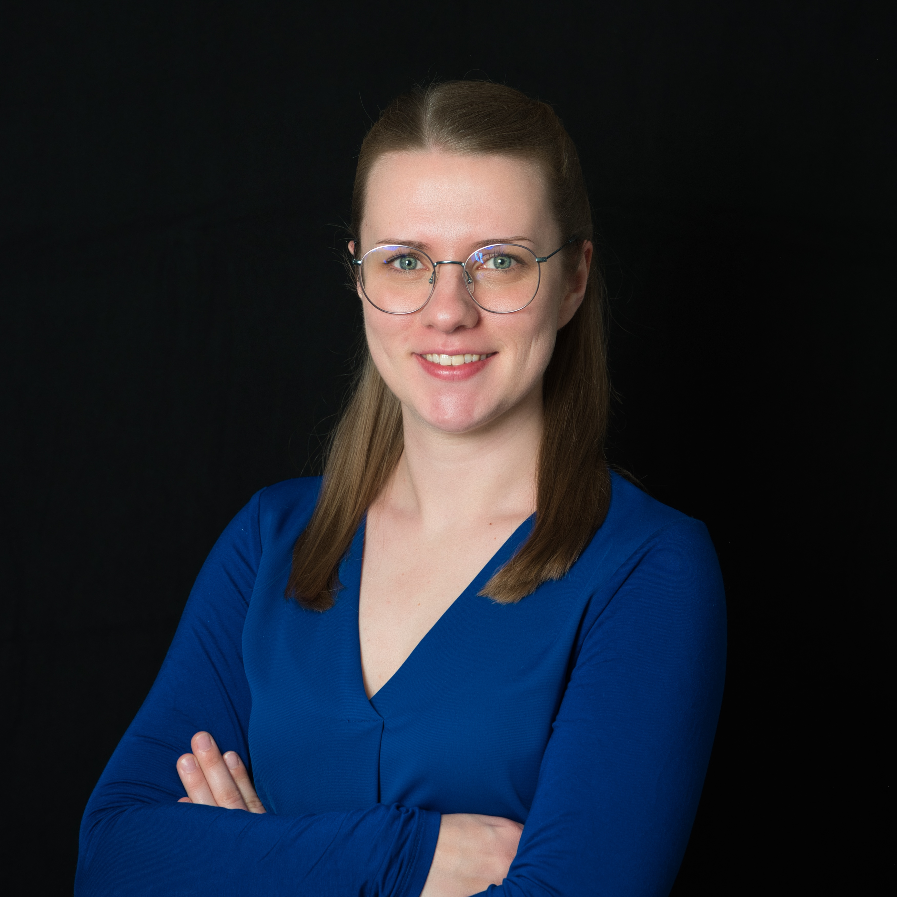
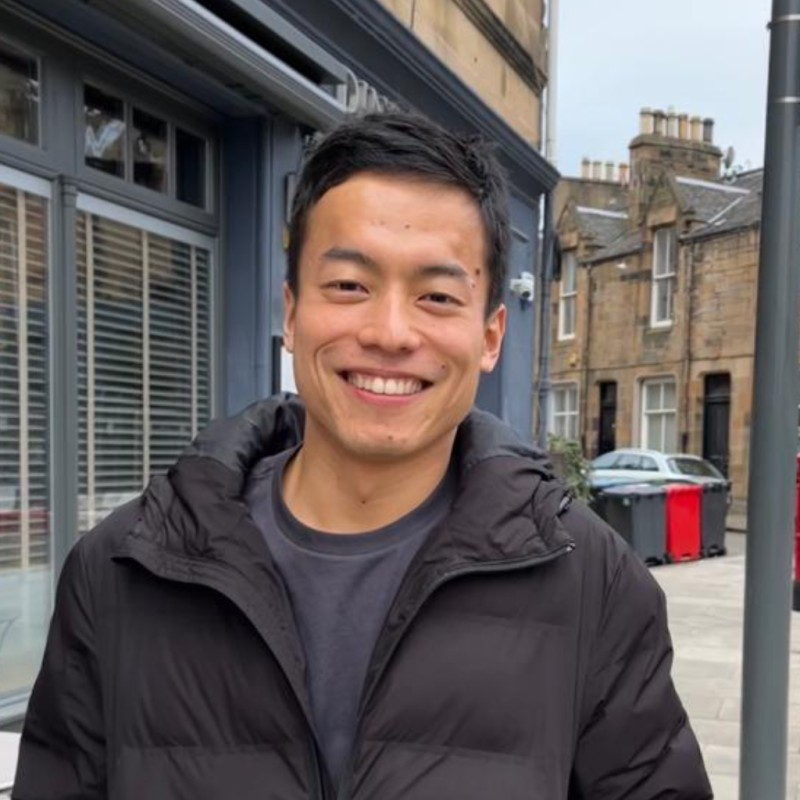

## Organizers

The current organizers are Yasmine Beck and Nagisa Sugishita. If you would like to give a talk in the BOS Webinar Series, please contact Nagisa Sugishita at nagisa [dot] sugishita [at] hec [dot] ca.

Yasmine Beck is an Assistant Professor of Operations Management at Eindhoven University of Technology since January 2026. Prior to this, she worked as a postdoctoral researcher at ESSEC Business School. Before joining ESSEC, she was a research and teaching assistant at Trier University, where she completed her PhD in December 2024. Her research interests lie at the intersection of (mixed-integer) bilevel optimization and optimization under uncertainty, with a focus on robust optimization.

Nagisa Sugishita is a postdoctoral fellow at HEC Montréal since March 2025. He completed his PhD at the University of Edinburgh in September 2022. His research interests range from applying bilevel programming to the development of sustainable and equitable transportation systems to studying the computational complexity of bilevel optimization.

