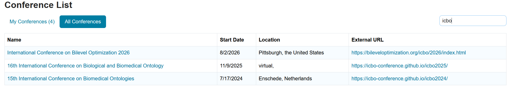

  

    <h2>Submissions</h2>

    
The submission process will be open from <strong>January 1st, 2026</strong> to <s>March 1st, 2026 <strong>April 1st, 2026</strong></s> <strong>the final deadline extension: April 15th, 2026</strong>. You can submit your contribution in the following link:

    
<a href="https://cmt3.research.microsoft.com/ICBO2026/Submission/Index">Submission link</a>

    
or by searching the ICBO conference in the <a href="https://cmt3.research.microsoft.com/ICBO2026/Submission/Index">CMT service portal</a>

    

    

      <strong>Some info:</strong>
       <strong>Abstract length:</strong> Up to 2,000 characters (including spaces).
       <strong>Keywords:</strong> 3–5 keywords are required.
    

    
Abstract submissions will be reviewed for relevance, originality, and technical quality.
       Accepted abstracts will be included in the conference program, and authors of accepted submissions will be invited to present their work at ICBO 2026. At least one author of each accepted submission must register for the conference and present the work.
    

    
The Microsoft CMT service was used for managing the peer-reviewing process for this conference.
       This service was provided for free by Microsoft and they bore all expenses,
       including costs for Azure cloud services as well as for software development and support.

  

